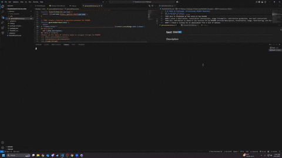
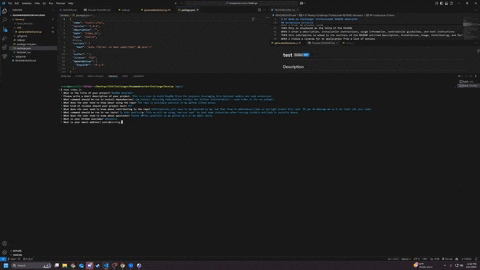

# **ReadMe Generator** -> 
## Description
  ### This is a tool to build ReadMe files for projects leveraging this terminal module and node extensions 
  >### Initialization Preview
  >

  >### Final Build Preview
  >
## Table of Contents
>Please use the table of contents below to navigate through the README
>>1. [Description](#Description)
>>2. [Installation](#Installation)
>>3. [Usage](#Usage)
>>4. [License](#License)
>>5. [Contributing](#Contributing)
>>6. [Tests](#Tests)
>>7. [Questions](#Questions)

## Installation
  > *npm install (Ensuring node_modules install for further functionality) - node index.js (to run prompt)*
## Usage
  ### The repo is available publicly on my github linked below as well as all of my other projects. 
  ### or visit https://github.com/aMononito/ReadmeGeneratorChal for this project specifically.
## License - MIT
* 
* https://opensource.org/licenses/MIT
* This project is licensed under the MIT license.
## Contributing
  ### Contributions will have to be approved by me, but feel free to add/remove/clean or outright branch this repo. If you do message me so I can check out your code! 
## Tests
  ### In this particular file we will be using 'npm run test' to test node connection after running installs outlined in installs above. 
# Questions

>* Please direct questions to my github dm's or my email below. 
>>* GitHub Username: [aMononito]https://github.com/aMononito 
>>* Email Address pedro@torstig.us
